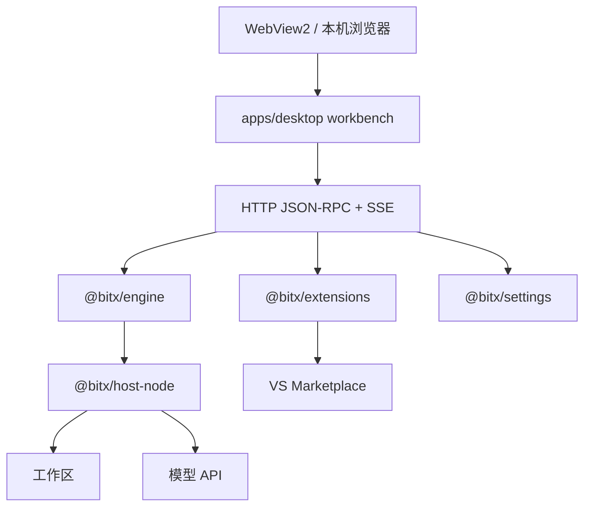

# 02 总架构

```mermaid
flowchart TB
  WV[WebView2 / 本机浏览器]
  WB[apps/desktop workbench]
  RPC[HTTP JSON-RPC + SSE]
  ORCH["@bitx/engine"]
  HOST["@bitx/host-node"]
  EXT["@bitx/extensions"]
  SET["@bitx/settings"]
  GAL[VS Marketplace]
  LLM[模型 API]
  WS[工作区]
  WV --> WB --> RPC
  RPC --> ORCH --> HOST --> WS
  RPC --> EXT --> GAL
  HOST --> LLM
  RPC --> SET
```

依赖只向下：`apps/desktop` → engine / host-node / extensions / settings；engine 禁止反向依赖壳。

编辑器隔离在工作台；默认 Monaco npm/CDN。窗口一期用 Node 服务 + 系统 WebView2/浏览器，只加载本仓页面。
