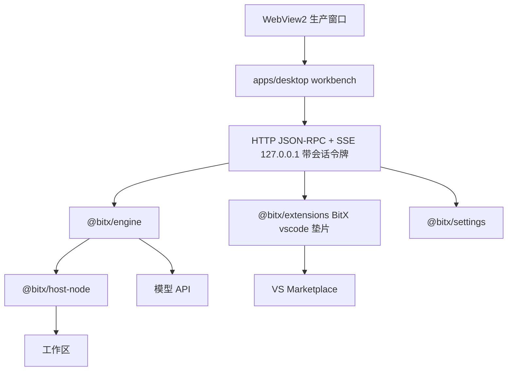

# 02 总架构

依赖只向下：`apps/desktop` → engine / host-node / extensions / settings；engine 禁止反向依赖壳。模型请求由 **引擎** 发出，不经过 Host。

编辑器隔离在工作台；**Monaco 打进旁路 zip**，禁止生产走 npm/CDN。生产窗口只用 WebView2 加载本机旁路页面（带 RPC 令牌）。系统浏览器仅开发机调试。

Agent 默认最高权限（`security.enforced: false`）。RPC 必须鉴权，避免本机其它进程冒用 Agent。
