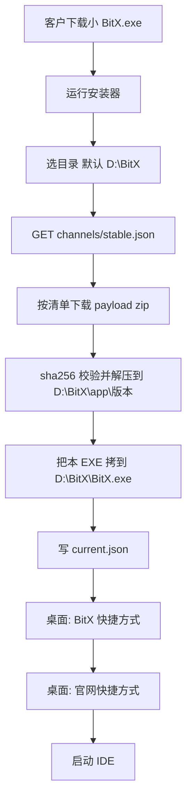
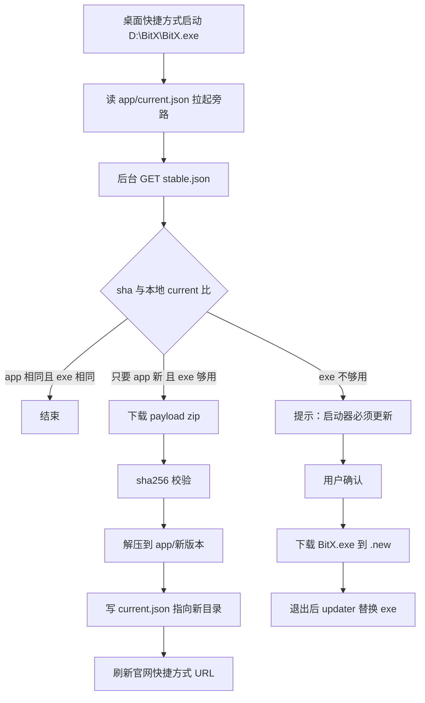

# 13 安装器与 GitHub 在线升级

客户拿到的 **`BitX.exe` 体积很小，本身是安装器**。运行后读本仓清单、下载旁路包、装到用户选的目录（默认 `D:\BitX`），再创建桌面快捷方式。装完以后同一份 EXE 留在安装目录当启动器：日常升级只换旁路，不覆盖 EXE。

## 客户第一次怎么装



规则：

1. **禁止** 把 GitHub 源码仓 `git clone` 到客户机。安装器只做 HTTPS：读 `stable.json`，再下 Release 里的 zip。文档和源码给开发者看，不给客户当运行时。
2. 默认目录 **`D:\BitX`**。用户可改。没有 D 盘时默认 **`C:\BitX`**。不要默认装进 `Program Files`（避免日常写盘要管理员）。
3. 必须联网完成首次安装。失败则停在安装器并显示原因，不要假装已经装好。
4. 装完后创建两个桌面快捷方式（默认都勾选，用户可取消）：
   - **BitX** → `D:\BitX\BitX.exe`（或用户选的目录）
   - **BitX 官网** → 清单里的 `website`（当前为 GitHub 仓首页，以后可改成产品站而不换 EXE）
5. 同一份小 EXE：无 `current.json` 时走安装向导；有则直接启动并后台检查更新。

## 安装后磁盘

```
D:\BitX\                             # 默认；用户可改
  BitX.exe                           # 安装器拷过来的启动器。日常升级禁止覆盖
  BitX.exe.manifest.json             # { "exeVersion": 1 }
  updater.exe                        # 仅 EXE 必升时用

  app\
    current.json                     # { "appVersion": "1.2.3", "dir": "1.2.3" }
    1.2.3\                           # 解压后的旁路：workbench / engine / host / node
    1.2.2\                           # 保留上一版，失败可回滚
  updates\
    staging\
  logs\install.log
  logs\update.log

桌面\
  BitX.lnk                           # 指向安装目录\BitX.exe
  BitX 官网.url                      # 指向 stable.json 的 website

%APPDATA%\BitX6-2\                   # 用户数据，重装/升级永不删除
  settings.json
  sessions\
  plugins\  mcp\  skills\
```

启动：`BitX.exe` 读安装目录下 `app\current.json` → 拉起该版本旁路。找不到旁路则回到安装器「继续完成下载」，**不要假装 EXE 里自带会 404 的 MCP。**

## 为什么要拆（EXE 仍然要小）

| 部件 | 变不变 | 体积 | 例子 |
| --- | --- | --- | --- |
| `BitX.exe` | 几乎不变 | 小 | 安装向导、开窗口、拉起 app、下载校验、切版本、写快捷方式 |
| `app/` 旁路包 | 经常变 | 大 | 工作台、引擎、Host、便携 Node |
| `store/` 三目录 | 独立变 | 按包 | 插件 / MCP / 技能，用户自己装 |

EXE 一旦写入安装目录，默认当成只读。升级器没有「顺手覆盖 exe」这条路径。

## 两个版本号（必须分开）

```json
{
  "exeVersion": 1,
  "appVersion": "1.2.3",
  "minExeVersion": 1
}
```

- `exeVersion`：整数。安装器协议、窗口、旁路目录约定变了才 +1。
- `appVersion`：旁路包。UI/引擎/修 bug 只动这个。
- `minExeVersion`：这份旁路要求启动器至少多少。本机 `exeVersion >= minExeVersion` 才允许只更旁路；否则 **必须先更 EXE**。

规则：

1. `appVersion` 更新且 `exeVersion` 够用 → **只下旁路 zip，EXE 字节不动。**
2. 频道里 `exeVersion` 比本机大 → 才下 `BitX.exe`（用户确认后，退出再替换）。
3. 禁止「为了发一版 UI 修过就把整个安装包重装」。

## GitHub 怎么放

升级通道、产品文档、扩展约定共用现有仓库：**[usabulusijock-create/bitx](https://github.com/usabulusijock-create/bitx)**。

公开仓即可，安装器读 raw / Releases **不用 Token**。不要改成私有。

### 这个仓现在还缺什么

文档与 `store/` 约定已在 main。客户要能装，还要补齐：

| 要有 | 作用 | 没有会怎样 |
| --- | --- | --- |
| `channels/stable.json`（main 分支） | 当前版本、下载地址、sha256、官网 URL | 安装器不知道下什么 |
| Release `app-x.y.z` | 旁路 zip：`payload-x.y.z.zip` | 没法装引擎/界面 |
| Release `exe-1`（很少打） | 小安装器 `BitX.exe` | 网站/GitHub 没有给客户下的入口 |
| `store/index.json`（以后） | 插件/MCP/技能货架 | 扩展仍可手拷到用户目录 |

不再做「胖 setup 安装包」当主路径。客户永远先下小 EXE，再从本仓拉旁路。

客户端写死（改这些 URL 才必须升 EXE）：

- 清单：`https://raw.githubusercontent.com/usabulusijock-create/bitx/main/channels/stable.json`
- 包体：清单里的 `app.url` / `exe.url`

### 频道清单

路径：`channels/stable.json`

```json
{
  "channel": "stable",
  "publishedAt": "2026-08-19T00:00:00Z",
  "exeVersion": 1,
  "appVersion": "1.2.3",
  "minExeVersion": 1,
  "website": "https://github.com/usabulusijock-create/bitx",
  "install": {
    "defaultDir": "D:\\BitX",
    "fallbackDir": "C:\\BitX"
  },
  "notes": "修复对话协议；不更换启动器",
  "app": {
    "url": "https://github.com/usabulusijock-create/bitx/releases/download/app-1.2.3/payload-1.2.3.zip",
    "sha256": "把打包后的64位hex填在这里",
    "size": 0
  },
  "exe": {
    "url": "https://github.com/usabulusijock-create/bitx/releases/download/exe-1/BitX.exe",
    "sha256": "把启动器hash填在这里",
    "size": 0
  }
}
```

`website`：桌面「BitX 官网」快捷方式的目标。以后换成产品站只改 JSON，不必换 EXE。旁路更新成功后按清单刷新该快捷方式的 URL。

`exe.url` 给新装分发页和「启动器必升」用。客户端：

```
本机 exeVersion === 清单 exeVersion  → 完全忽略 exe.url，不下载
本机 exeVersion < 清单 exeVersion    → 才下载 exe（用户点「更新启动器」）
```

### GitHub Release 资产怎么切

| Release tag | 里面有什么 | 何时打 |
| --- | --- | --- |
| `app-1.2.3` | 仅 `payload-1.2.3.zip` | 几乎每次发版 |
| `exe-1`、`exe-2` | 仅小安装器 `BitX.exe`（可附 `updater.exe`） | 安装器协议变了才打 |

发版步骤：打 zip → 算 sha256 → 建 Release 上传 → 改 `channels/stable.json` → push main。

日常 CI：改了旁路代码 → 只发 `app-*`。改了安装器 → `exeVersion` +1 并发 `exe-*`。

## 装完以后的升级



细节：

1. **校验**：zip 与 exe 都要 sha256；失败删除 staging，保留旧 `current`，界面可工作。
2. **原子切旁路**：先解压到新文件夹，最后改 `current.json`。不要解压覆盖正在跑的目录。
3. **回滚**：保留上一份 `app/<旧版本>`；`current.json` 写坏就回上一份。
4. **EXE 替换（仅必升）**：Windows 不能覆盖正在运行的 exe。流程是：
   - 把新文件存成 `BitX.exe.new`
   - 用户退出后 `updater.exe`：`BitX.exe` → `BitX.exe.bak`，`.new` → `BitX.exe`，再启动
   - 失败则 bak 改回
5. **权限**：默认 `D:\BitX` 普通用户可写，不必每次 UAC。
6. **增量（可选）**：旁路 zip 先整包；体积大了再加 `bsdiff`。EXE 不做增量。

## 启动器（EXE）里到底有什么

只允许这些，才能长期保持小体积、少改字节：

- 安装向导：选目录（默认 `D:\BitX`）、进度、失败原因
- 读 `stable.json`、下载、校验、解压、写 `current.json`
- 创建 / 刷新桌面「BitX」与「BitX 官网」快捷方式
- 创建 WebView2 / 本机窗口，定位 `current.json` 并启动旁路 Node
- 发现 `minExeVersion` 不够时走 EXE 更新
- 崩溃日志

禁止打进 EXE：引擎、工作台 HTML、MCP、技能、插件、模型列表、便携 Node。这些全在旁路 zip 或 store。

禁止：内置 git、clone 本仓、把 `docs/` `store/` 当运行时拷到客户机。

## 和 store 三目录的关系

| 更新对象 | 通道 | 是否动 EXE |
| --- | --- | --- |
| 工作台 / 引擎 | `appVersion` + payload zip → `D:\BitX\app\` | 否 |
| 插件 / MCP / 技能 | 网站或 GitHub 上的包索引，装进 `%APPDATA%\BitX6-2\{plugins,mcp,skills}` | 否 |
| 启动器 / 安装器 | `exeVersion` | 是，且仅此 |

store 包 **自包含、能启动**。未安装 = 目录里没有这项能力，核心读写仍由引擎工具完成，**不是**「启动失败 404」。已安装则必须能跑；跑不起来是打包事故，禁止带病发版。

## 新用户 vs 老用户

- **新用户**：下很小的 `BitX.exe` → 联网拉当前旁路 → 装到 `D:\BitX`（可改）→ 桌面两个快捷方式。
- **老用户**：点桌面 BitX，只拉比本地新的 payload；安装目录里的 EXE 可以长期不变。

## 安全

- 只信任 `github.com/usabulusijock-create/bitx` 与 `raw.githubusercontent.com/usabulusijock-create/bitx`。
- 必须校验 sha256，禁止只比文件名。
- 官网快捷方式只允许 `https`，URL 必须来自清单 `website` 字段。
- 可选：清单用私钥签名，EXE 内置公钥（公钥变了才需要升 EXE）。
- 不在更新通道里下 MCP 的随机 URL。

## 客户机不得报毒（发版硬条件）

未签名、乱壳、天天换哈希的小安装器，Windows 会当成木马下载器。客户一害怕就不会装。**禁止靠「免杀、加壳、关 Defender」混过去。** 必须正规到 Defender / SmartScreen 默认可过。

### 必须做

1. **Authenticode 代码签名**（Windows 证书，不是 HTTPS 网站证）。公司名写进证书与 EXE 版本信息，两者一致。
   - 起步：OV 组织验证证书。
   - 给客户用的安装器优先 **EV 代码签名**：SmartScreen 对 EV 新品信任更快；OV 新品仍常出「Windows 已保护你的电脑」。
   - 签名必须带 **时间戳**（timestamp），证书过期后已发出的 EXE 仍然有效。
2. **版本资源填满**：`CompanyName`、`ProductName=BitX`、`FileDescription`、`LegalCopyright`、`FileVersion`。禁止空公司、Generic、Setup 这类名字。
3. **安装器很少换哈希**：日常只发旁路 zip。EXE 哈希稳定，SmartScreen 信誉才积得起来。每次重编未改协议的 EXE = 信誉清零。
4. **只连本仓 HTTPS**：清单 + GitHub Releases。禁止随机域名、禁止 HTTP、禁止再套一层不明 CDN 跳转。
5. **payload 也干净**：旁路 zip 里用官方便携 Node，不壳、不加密整包、不塞无关 exe。zip 的 sha256 写在 `stable.json`。
6. **发客户包之前在干净 Windows 上自检**：右键属性能看到数字签名；Defender 实时保护开着，安装全过程无威胁提示。有提示就 **停发**，先改签名/构建，再发。

### 禁止做（这些最容易报毒）

- UPX / VMProtect / Themida / 乱壳、加花、加密区段
- 无签名就上网分发
- 安装器再去下 **未签名** 的第二个 exe
- 往启动项、计划任务、其它进程里偷偷写（桌面快捷方式可以，这是正常安装）
- 提示用户关闭杀毒、加入白名单、关 SmartScreen
- 把未签名测试包传到 VirusTotal 公开扫（厂商会学这个哈希，一次脏掉很难洗）

### SmartScreen「仍提示未知应用」时

新证书前几天可能还有蓝页，这不是杀毒报木马，是信誉未建立。处理：

1. 确认已 EV 签名 + 时间戳。
2. 用 [Microsoft 文件提交](https://www.microsoft.com/en-us/wdsi/filesubmission) 把 **已签名** 的 `BitX.exe` 报成软件误报。
3. 不要换证书、不要重编 EXE 凑信誉。
4. 下载页写清发布者名称，与证书上的组织名相同。

未过上述条件的 EXE **不准** 放到 GitHub Release 当客户下载入口。
