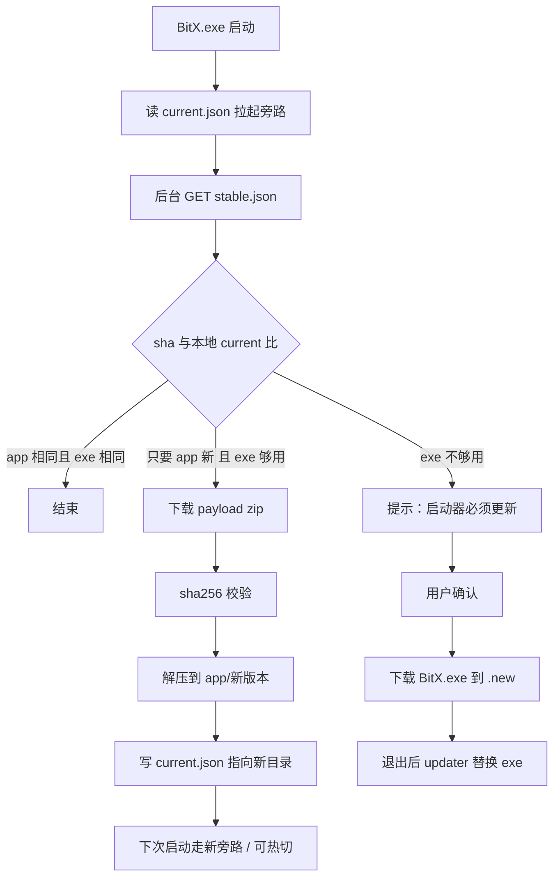

# 13 GitHub 在线升级（EXE 冻结）

装完以后，**日常升级只换旁路文件，不碰 `BitX.exe`。** 只有启动器自己坏了、或旁路协议不兼容时，才换 EXE。

## 为什么要拆

| 部件 | 变不变 | 体积 | 例子 |
| --- | --- | --- | --- |
| `BitX.exe` | 几乎不变 | 小 | 开窗口、拉起 app、下载校验、切版本 |
| `app/` 旁路包 | 经常变 | 大 | 工作台、引擎、Host、资源 |
| `store/` 三目录 | 独立变 | 按包 | 插件 / MCP / 技能，用户自己装 |

EXE 一旦写入「安装目录」，默认当成只读。升级器没有「顺手覆盖 exe」这条路径。

## 安装后磁盘（用户机器）

```
<安装目录>/                          # 例 C:\Program Files\BitX\
  BitX.exe                           # 启动器。日常升级禁止覆盖
  BitX.exe.manifest.json             # { "exeVersion": 1 }
  updater.exe                        # 仅 EXE 必升时用；可与 BitX.exe 同版本号

%LOCALAPPDATA%\BitX6-2\
  app\
    current.json                     # { "appVersion": "1.2.3", "dir": "1.2.3" }
    1.2.3\                           # 解压后的旁路：workbench / engine / host / node
    1.2.2\                           # 保留上一版，失败可回滚
  updates\
    staging\                         # 下载中，校验通过才晋级
  logs\update.log

%APPDATA%\BitX6-2\                   # 用户数据，升级永不删除
  settings.json
  sessions\
  plugins\  mcp\  skills\            # 用户安装的扩展，不跟主程序包走
```

启动：`BitX.exe` 读 `current.json` → 用该目录里的 Node/页面把 IDE 拉起来。找不到旁路则提示「请联网完成首次组件安装」，**不要假装 EXE 里自带会 404 的 MCP。**

## 两个版本号（必须分开）

```json
{
  "exeVersion": 1,
  "appVersion": "1.2.3",
  "minExeVersion": 1
}
```

- `exeVersion`：整数。窗口、更新器、进程模型、旁路目录约定变了才 +1。
- `appVersion`：旁路包。UI/引擎/修复 bug 只动这个。
- `minExeVersion`：这份旁路要求启动器至少多少。本机 `exeVersion >= minExeVersion` 才允许只更旁路；否则 **必须先更 EXE**。

规则：

1. `appVersion` 更新且 `exeVersion` 够用 → **只下旁路 zip，EXE 字节不动。**
2. 频道里 `exeVersion` 比本机大 → 才下 `BitX.exe`（用户确认后，退出再替换）。
3. 禁止「为了发一版 UI 修过就把整个安装包重装」。

## GitHub 怎么放

升级通道、产品文档、扩展约定共用现有仓库：**[usabulusijock-create/bitx](https://github.com/usabulusijock-create/bitx)**。不再另开 `BitX-updates` 仓。`docs/` 与 `store/` 必须与本地同步，方便开源和客户查询。

公开仓即可，客户端读 raw / Releases **不用 Token**。不要把这个仓改成私有，否则每台客户机都要配 GitHub 密钥。

### 这个仓现在还缺什么

当前仓几乎只有 README，还不能升级。要补齐：

| 要有 | 作用 | 没有会怎样 |
| --- | --- | --- |
| `channels/stable.json`（main 分支） | 告诉客户端：当前 appVersion / exeVersion、下载地址、sha256 | EXE 不知道升什么 |
| Release `app-x.y.z` | 旁路 zip：`payload-x.y.z.zip` | 没法换引擎/界面 |
| Release `exe-1`（很少打） | `BitX.exe` + `updater.exe` | 只有启动器协议变了才需要 |
| Release `setup-x.y.z`（可选） | 新用户安装包 | 老用户不靠这个升级 |
| `store/index.json`（以后） | 插件/MCP/技能货架 | 扩展仍可手拷到用户目录 |

**不需要再申请的：** 第二个仓库、客户 GitHub 账号、每次升级都重打 EXE。

客户端写死（以后 EXE 里只改这里的域名就算「必须升 EXE」）：

- 清单：`https://raw.githubusercontent.com/usabulusijock-create/bitx/main/channels/stable.json`
- 包体：清单里的 `app.url` / `exe.url`（指向本仓 Releases）

### 频道清单

路径：`channels/stable.json`（可再加 `beta.json`）

```json
{
  "channel": "stable",
  "publishedAt": "2026-08-19T00:00:00Z",
  "exeVersion": 1,
  "appVersion": "1.2.3",
  "minExeVersion": 1,
  "notes": "修复对话协议；不更换启动器",
  "app": {
    "url": "https://github.com/usabulusijock-create/bitx/releases/download/app-1.2.3/payload-1.2.3.zip",
    "sha256": "把打包后的64位hex填在这里",
    "size": 0
  },
  "exe": {
    "url": "https://github.com/usabulusijock-create/bitx/releases/download/exe-1/BitX.exe",
    "sha256": "把启动器hash填在这里",
    "size": 0
  }
}
```

`exe.url` 可以一直写着给新装用。客户端：

```
本机 exeVersion === 清单 exeVersion  → 完全忽略 exe.url，不下载
本机 exeVersion < 清单 exeVersion    → 才下载 exe（用户点「更新启动器」）
```

### GitHub Release 资产怎么切

| Release tag | 里面有什么 | 何时打 |
| --- | --- | --- |
| `app-1.2.3` | 仅 `payload-1.2.3.zip` | 几乎每次发版 |
| `exe-1`、`exe-2` | 仅 `BitX.exe` + `updater.exe` | 启动器协议变了才打 |
| `setup-1.2.3` | 全量安装包 | 给新用户 |

发版步骤（人工也可）：打 zip → 算 sha256 → 建 Release 上传 → 改 `channels/stable.json` 的 version/url/sha256 → push main。

日常 CI：改了旁路代码 → 只发 `app-*`。改了启动器 → `exeVersion` +1 并发 `exe-*`。

## 客户端升级流程



细节：

1. **校验**：zip 与 exe 都要 sha256；失败删除 staging，保留旧 `current`，界面可工作。
2. **原子切旁路**：先解压到新文件夹，最后改 `current.json`。不要解压覆盖正在跑的目录。
3. **回滚**：保留上一份 `app/<旧版本>`；`current.json` 写坏就回上一份。
4. **EXE 替换（仅必升）**：Windows 不能覆盖正在运行的 exe。流程是：
   - 把新文件存成 `BitX.exe.new`
   - 用户退出后 `updater.exe`：`BitX.exe` → `BitX.exe.bak`，`.new` → `BitX.exe`，再启动
   - 失败则 bak 改回
5. **权限**：旁路写在 `%LOCALAPPDATA%`，普通用户可写，不必每次 UAC。EXE 若在 `Program Files`，换 EXE 才可能要一次管理员，这是「很少发生」的代价。
6. **增量（可选）**：旁路 zip 可用「整包」起步；体积大了再加 `bsdiff` 对上一 `appVersion` 的补丁，清单里加 `deltaFrom`。EXE 不做增量。

## 启动器（EXE）里到底有什么

只允许这些，才能长期不改字节：

- 创建 WebView2 / 本机窗口
- 定位 `current.json` 并启动旁路 Node
- 拉取 `stable.json`、下载、校验、解压、切 `current`
- 发现 `minExeVersion` 不够时走 EXE 更新
- 崩溃日志

禁止打进 EXE：引擎、工作台 HTML、MCP、技能、插件、模型列表。这些全在旁路 zip 或 store。

EXE 与旁路约定用 **整数协议号**（即 `exeVersion` / `minExeVersion`），不要用「EXE 里写死 app 路径结构然后天天改」。

## 和 store 三目录的关系

| 更新对象 | 通道 | 是否动 EXE |
| --- | --- | --- |
| 工作台 / 引擎 | `appVersion` + payload zip | 否 |
| 插件 / MCP / 技能 | 网站或 GitHub 上的包索引，装进 `%APPDATA%\BitX6-2\{plugins,mcp,skills}` | 否 |
| 启动器 | `exeVersion` | 是，且仅此 |

store 包 **自包含、能启动**。未安装 = 目录里没有这项能力，核心读写仍由引擎工具完成，**不是**「启动失败 404」。已安装则必须能跑；跑不起来是打包事故，禁止带病发版。

## 新用户 vs 老用户

- **新装**：`setup` 安装包 = 当前 `BitX.exe` + 当前旁路（第一次就能离线打开）。
- **老用户**：只拉 GitHub 上比本地新的 payload；EXE 文件日期可以几年不变。

## 安全

- 只信任 `github.com/usabulusijock-create/bitx` 与 `raw.githubusercontent.com/usabulusijock-create/bitx`。
- 必须校验 sha256，禁止只比文件名。
- 可选：清单用你们的私钥签名，EXE 内置公钥（公钥变了才需要升 EXE）。
- 不在更新通道里下 MCP 的随机 URL。
